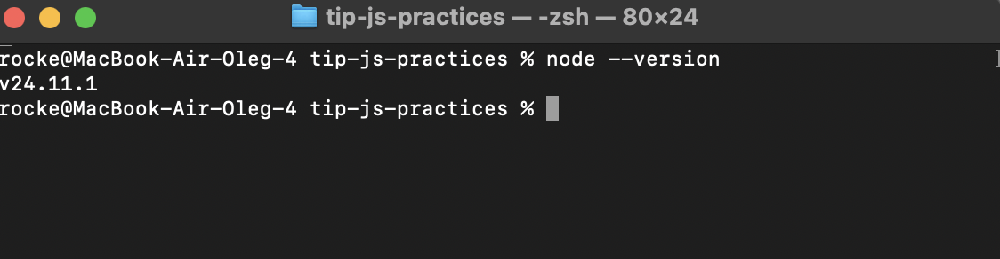
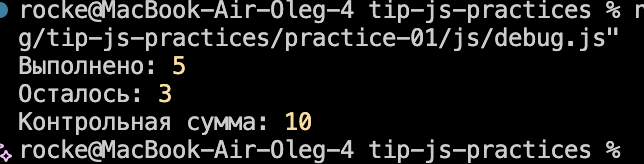

1. Счётчиков Олег, ЭФБО-03-25, Вариант 1

2. Окружение

MacOS Sequoia 15.7.9

node --version

npm --version

git --version

Браузер Chrome

3. Запуск

С помощью браузера был открыт файл practice-01/index.html, открыт Console в DevTools, в процессе работы путь в src="./js/hello.js" заменялся на соответствующие заданиям файлы.

С помощью команды node practice-01/js/hello.js был запущен скрипт hello.js, аналогично для других скриптов:

node js/types.js

node js/progress.js

node js/plan.js

node js/debug.js

4. Задание 1

Вывод: консоли vs code 

Вывод в консоли в браузере:

В браузере существует глобальный объект document, поэтому его тип корректно выводится в консоли. Для запуска через node js же выводится undefined, т.к. этого объекта не существует в среде Node.js

5. Задание 2

| Выражение | Ожидание до запуска | Фактическое значение | Тип результата | Объяснение |
| :--- | :--- | :--- | :--- | :--- |
| `"8" + 2` | 82 | 82 | string | JS делает приведение числа 2 в строку, а потом конкатенацию |
| `"8" - 2` | 6 | 6 | number | Оператор `-` не умеет работать со строками, поэтому пытается привести все элементы выражения в числам, таким образом строка "8" стала числом 8 и произвелось вычитание |
| `Number("8") + 2` | 10 | 10 | number | Строка "8" приводится к типу number и складывается с числом 2 |
| `"12" > "3"` | false | false | boolean | JS сравнил строки по кодам их символом в unicode, таким образом при сравнении кодов вернулось false |
| `12 === "12"` | false | false | boolean | Оператор `===` - строгое равенство, а 12 и "12" имеют разные типы данных, поэтому вывелось false |
| `Number("")` | 0 | 0 | number | При преобразовании пустой строки в число возвращается ноль|
| `Number("text")` | NaN | NaN | number | Строка, не содержащая числового значения не может быть приведена к числовому типу, поэтому возвращается NaN |
| `Boolean("false")` | true | true | boolean | Любая непустая строка в JS приводится к true |
| `typeof null` | null | object | string | JS интерпретирует null как самостоятельный объект, хоть и по логике null обозначает его отсутствие |
| `typeof NaN` | number | number | string | NaN технически является числовым типом данных, поэтому typeof возвращает строку "number" |

6. Задание 3

| Проверка | Входные данные | Ожидаемый результат | Фактический результат | Итог |
|----------|----------------|---------------------|-----------------------|------|
| Индивидуальный вариант | `totalTasks = 12` `completedTasks = 5` | Программа должна определить, что осталось 7 задач, прогресс составляет 41.7%, статус — «В работе». | Всего задач: 12 Выполнено: 5 Осталось: 7 Прогресс: 41.7% Статус: В работе | Пройдено |
| Граничный случай | `totalTasks = 0` `completedTasks = 0` | Программа должна вывести сообщение «Задач пока нет». | Задач пока нет | Пройдено |
| Некорректные данные | `totalTasks = 5` `completedTasks = 7` | Программа должна сообщить об ошибке, так как выполнено больше задач, чем существует. | Ошибка: выполнено больше, чем существует. | Пройдено |

7. Задание 4.

| Проверка | Входные данные | Ожидаемый результат | Фактический результат | Итог |
|----------|----------------|---------------------|-----------------------|------|
| Индивидуальный вариант | `totalTasks = 12` `completedTasks = 5` `dailyLimit = 3` | Программа должна определить, что осталось 7 задач, и рассчитать завершение за 3 дня. | Осталось задач: 7 День 1: выполнено 3, осталось 4 День 2: выполнено 3, осталось 1 День 3: выполнено 1, осталось 0 Потребуется дней: 3 | Пройдено |
| Граничный случай | `totalTasks = 5` `completedTasks = 5` `dailyLimit = 2` | Программа должна сообщить, что все задачи уже выполнены, количество дней — 0. | Все задачи уже выполнены. Потребуется дней: 0 | Пройдено |
| Некорректные данные | `totalTasks = 5` `completedTasks = 7` `dailyLimit = 2` | Программа должна сообщить об ошибке, так как выполнено больше задач, чем существует. | Ошибка: некорректное число выполненных задач. | Пройдено |

8.

Задание 5. 

Фактический вывод исходной программы:

Вывод после исправления:

| Ошибка | Что наблюдалось | Причина | Исправление | Результат после исправления |
|---------|-----------------|----------|-------------|-----------------------------|
| Некорректное сложение выполненных задач | Вместо числа `5` программа выводила `32`, из-за чего неверно вычислялось количество оставшихся задач | Переменные `completedText` и `additionalText` имели тип `string`, поэтому оператор `+` выполнял конкатенацию строк | Преобразованы строки в числа с помощью `Number()`, после чего выполнено числовое сложение | Программа корректно выводит `Выполнено: 5` и `Осталось: 3` |
| Ошибка в условии цикла | Контрольная сумма была равна `6` вместо `10` | Условие `taskNumber < 4` не включало число `4` в расчёт | Условие цикла изменено на `taskNumber <= 4` | Контрольная сумма стала равна `10` |

8. Дополнительное задание

Недостаточно преобразовать значение с помощью Number() и проверить, что оно неотрицательное, потому что некоторые данные в JavaScript могут также быть преобразованы в числа, например, "" или "   ". При Number("") и Number("   ") будет возвращён 0. Также стоит дополнительно обработать null, undefined, NaN и проверять, что результат входит в ограничения и является целым числом.

9. Вывод

В ходе выполнения практической работы были изучены основы языка JavaScript, особенности работы в браузере и среде Node.js, а также принципы преобразования типов данных, использования условных операторов и циклов. Были получены навыки проверки корректности входных данных, обработки ошибок и тестирования программ с использованием различных данных.

Наиболее показательной оказалась ошибка, связанная с неявным преобразованием типов при использовании оператора "+". Из-за сложения строк вместо чисел программа формировала неверный результат, что показало важность явного преобразования данных. Использование отладчика в Chrome позволило определить место возникновения ошибки и проверить корректность её исправления.

Дополнительно был выполнен вариант А, в котором входные данные поступают в виде строк. Реализована предварительная обработка данных с использованием "trim()" и "Number()", а также проверка пустого и некорректного ввода перед выполнением основной логики программы.